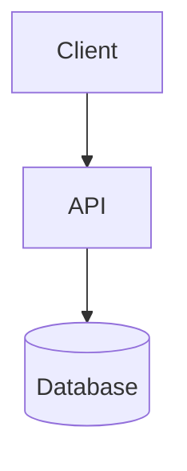

# Create Blurb

Create rich markdown artifacts with inline widgets — charts, diagrams, maps, timelines, calendars, tables, math, embeds, sketches — published as shareable URLs.

## API

**Base URL:** `https://blurb.md`

| Method | Endpoint | Description |
|--------|----------|-------------|
| POST | `/~/public` | Create a folder with files |
| GET | `/~/public/:slug` | Get folder with all files + comments |
| PUT | `/~/public/:slug` | Upsert folder (update metadata + add/update files, preserves unmentioned files) |
| POST | `/~/public/:slug/@replace` | Destructive full replace (wipes all files, comments, replies) |
| GET | `/~/public/:slug/:path` | Read a single file |
| PUT | `/~/public/:slug/:path` | Create or replace a file (upsert) |
| PATCH | `/~/public/:slug/:path` | Edit file (old_str/new_str diffs) |
| DELETE | `/~/public/:slug/:path` | Delete file + its comments |
| POST | `/~/public/:slug/:path/@comments` | Add a comment to a file |
| DELETE | `/~/public/:slug/:path/@comments/:id` | Delete a comment |
| POST | `/~/public/:slug/:path/@comments/:id/replies` | Add a reply to a comment |

### Create a folder

```bash
curl -X POST https://blurb.md/~/public \
  -H "Content-Type: application/json" \
  -d '{"title":"Report Title","files":[{"path":"report.md","content":"...markdown..."}]}'
```

Returns `{"id":"...","slug":"adj-animal-NNNN"}`. The report is viewable at `https://blurb.md/~/public/{slug}`.

**Files use paths** — organize with folders:
```json
{
  "title": "Experiment Results",
  "files": [
    {"path": "overview.md", "content": "# Overview\n..."},
    {"path": "experiments/baseline.md", "content": "# Baseline\n..."},
    {"path": "experiments/with-cache.md", "content": "# With Cache\n..."}
  ]
}
```

Allowed file extensions: `.md`, `.mdx`, `.json`, `.ts`, `.tsx`, `.js`, `.jsx`, `.py`, `.rs`, `.go`, `.java`, `.css`, `.html`, `.yaml`, `.yml`, `.toml`, `.sql`, and more. Markdown files render in preview mode; code files render with syntax highlighting.

### Read a file

```bash
curl https://blurb.md/~/public/:slug/:path \
  -H "Accept: application/json"
```

Always read before editing — you need the current content to produce correct diffs.

### Create or replace a file (idempotent PUT)

```bash
curl -X PUT https://blurb.md/~/public/:slug/:path \
  -H "Content-Type: application/json" \
  -d '{"content":"# New Page\n..."}'
```

### Edit a file (diff-based)

```bash
curl -X PATCH https://blurb.md/~/public/:slug/:path \
  -H "Content-Type: application/json" \
  -d '{"updates":[{"old_str":"exact text to find","new_str":"replacement text"}]}'
```

### Delete a file

```bash
curl -X DELETE https://blurb.md/~/public/:slug/:path
```

### Permissions (chmod-style)

Folders have a `mode` field — two octal digits (owner, public). Bits: `4=read, 2=comment, 1=write`.

| Mode | Meaning |
|------|---------|
| `76` | Default — owner has all, public can read+comment |
| `74` | Locked — public read-only, no comments |
| `70` | Private — only token holders can access |

```bash
# Create a locked folder (no public comments)
curl -X POST https://blurb.md/~/public \
  -d '{"mode": "74", "files": [...]}'

# Lock an existing folder
curl -X PUT https://blurb.md/~/public/:slug \
  -H "Authorization: Bearer <token>" \
  -d '{"mode": "74"}'
```

Token holders always bypass mode restrictions. `ADMIN_TOKEN` is superuser.

### PUT vs @replace

- `PUT /~/public/:slug` — **safe**: upserts files, updates metadata, preserves unmentioned files and comments
- `POST /~/public/:slug/@replace` — **destructive**: wipes all files, comments, replies and recreates from scratch

Use PUT for incremental updates. Use @replace only when you need a clean slate.

## Workflow

### 1. Write the markdown

Write a markdown document with embedded widgets. See [references/widget-spec.md](references/widget-spec.md) for full widget specs.

### 2. Publish via API

```bash
curl -s -X POST https://blurb.md/~/public \
  -H "Content-Type: application/json" \
  -d "$(cat <<'ENDJSON'
{"title":"My Report","files":[{"path":"report.md","content":"# Title\n\nContent here..."}]}
ENDJSON
)"
```

### 3. Share the URL

The response contains a `slug`. The report is live at:
```
https://blurb.md/~/public/{slug}
```

## Available Widgets

### Charts (`chart` code block)

Bar, line, pie, doughnut, radar, polar area, scatter, bubble — powered by Chart.js.

````markdown
```chart
{"config":{"type":"bar","data":{"labels":["Q1","Q2","Q3"],"datasets":[{"label":"Revenue","data":[2.4,3.1,3.8]}]}}}
```
````

Also works via `` ```widget `` with explicit `"type":"chart"` and `"widgetId"`, but `` ```chart `` is simpler.

### Mermaid Diagrams (`mermaid` code block)

Flowcharts, sequence diagrams, ER diagrams, Gantt charts, etc.

````markdown

````

### Math / LaTeX (`math` code block)

KaTeX-rendered math expressions.

````markdown
```math
E = mc^2
```
````

### Tables (`table` code block)

Sortable tables from JSON. Click headers to sort.

````markdown
```table
{"caption":"Team Stats","columns":["Name","Score"],"rows":[{"Name":"Alice","Score":95},{"Name":"Bob","Score":88}]}
```
````

### Maps (`map` code block)

MapLibre GL vector maps with markers. Dark Matter (dark) / Voyager (light) tiles.

````markdown
```map
{"zoom":4,"center":[20,110],"markers":[{"location":[1.35,103.82],"label":"Singapore"},{"location":[39.90,116.41],"label":"Beijing"}]}
```
````

Spec: `center` is `[lat, lng]`, `markers[].location` is `[lat, lng]`. Set `controls: true` to show zoom buttons.

### Timeline (`timeline` code block)

Vertical chronological timeline with colored dots.

````markdown
```timeline
{"events":[{"date":"2025-01-15","title":"Kickoff","description":"Project started"},{"date":"2025-03-01","title":"Launch","description":"v1.0 released"}]}
```
````

### Calendar (`calendar` code block)

Month grid with colored event ranges.

````markdown
```calendar
{"month":"2025-03","events":[{"start":"2025-03-01","end":"2025-03-03","title":"Sprint 1","color":"#6a8ac0"},{"start":"2025-03-08","end":"2025-03-10","title":"Sprint 2","color":"#7aa874"}]}
```
````

If `month` is omitted, it's inferred from the earliest event.

### Embeds (`embed` code block)

Sanitized iframes for YouTube, Vimeo, Loom, Figma, CodeSandbox, StackBlitz, etc. Share URLs auto-convert to embed URLs.

````markdown
```embed
https://www.youtube.com/watch?v=dQw4w9WgXcQ
```
````

### Diffs (`diff` code block)

Syntax-highlighted code diffs.

````markdown
```diff
{"language":"typescript","filename":"api.ts","old":"const x = 1","new":"const x = 2"}
```
````

### HTML (`html` code block)

Render custom HTML/CSS/SVG directly — no iframe, no predefined structure. DOMPurify strips scripts and event handlers; `<style>` blocks are auto-scoped to the widget so CSS doesn't leak.

````markdown
```html
<style>
  .metric-grid { display: grid; grid-template-columns: repeat(3, 1fr); gap: 12px; }
  .metric-card { padding: 16px; border-radius: 8px; background: rgba(193, 95, 60, 0.08); border: 1px solid rgba(193, 95, 60, 0.15); }
  .metric-value { font-size: 1.8em; font-weight: 700; color: #C15F3C; }
  .metric-label { font-size: 0.85em; opacity: 0.6; margin-top: 4px; }
</style>
<div class="metric-grid">
  <div class="metric-card">
    <div class="metric-value">12.4k</div>
    <div class="metric-label">Monthly Active Users</div>
  </div>
  <div class="metric-card">
    <div class="metric-value">98.2%</div>
    <div class="metric-label">Uptime</div>
  </div>
</div>
```
````

Good for: custom layouts, inline SVG, styled cards, anything the predefined widgets don't cover. No JavaScript — use the `html-app` widget (sandboxed iframe) if you need interactivity.

Forbidden tags: `script`, `iframe`, `object`, `embed`, `form`, `input`, `textarea`, `button`, `select`.

### Sketches (`sketch` code block)

Hand-drawn diagrams via Rough.js. Elements: `rect`, `ellipse`, `line`, `arrow`, `text`.

````markdown
```sketch
{"width":500,"height":200,"elements":[{"type":"rect","x":30,"y":60,"width":130,"height":70,"fill":"#a5d8ff","color":"#1971c2","label":"Client"},{"type":"arrow","x1":160,"y1":95,"x2":280,"y2":95,"color":"#868e96","label":"REST"},{"type":"rect","x":280,"y":60,"width":130,"height":70,"fill":"#b2f2bb","color":"#2f9e44","label":"API"}]}
```
````

### Globe (`globe` code block)

Interactive WebGL globe with markers (COBE).

````markdown
```globe
{"markers":[{"location":[37.77,-122.42],"size":0.1},{"location":[51.51,-0.13],"size":0.08}]}
```
````

## Citations

Use `[^key]` markers inline and `[^key]: text` definitions. Hover shows rich tooltips.

```markdown
Vector search is standard[^1]. Hybrid methods outperform[^2].

[^1]: Karpukhin et al., 2020. "Dense Passage Retrieval." EMNLP.
[^2]: Ma et al., 2023. "Hybrid Search Revisited." SIGIR.
```

## Comment Notifications (real-time)

Every folder automatically gets a [hook.new](https://hook.new) webhook. When a user comments or replies, blurb fires an event to hook.new, and you can listen for it via SSE — no public URL needed.

### Listening for comments

After creating a folder, use the returned `hook` to listen for comments. The script at [scripts/hook-listen.ts](scripts/hook-listen.ts) blocks until one SSE event arrives, prints it, and exits.

Workflow:

```bash
# 1. Create folder — save the hook details
RESULT=$(curl -s -X POST https://blurb.md/~/public \
  -H "Content-Type: application/json" \
  -d '{"title":"Report","files":[{"path":"report.md","content":"# Report\n\nContent..."}]}')
HOOK_ID=$(echo "$RESULT" | jq -r '.hook.hook_id')
MANAGE_TOKEN=$(echo "$RESULT" | jq -r '.hook.manage_token')
SLUG=$(echo "$RESULT" | jq -r '.slug')

# 2. Create a watch sink (SSE) on hook.new
WATCH=$(curl -s -X POST "https://hook.new/h/$HOOK_ID/sinks" \
  -H "Authorization: Bearer $MANAGE_TOKEN" \
  -H "Content-Type: application/json" \
  -d '{"kind":"watch","mode":"observe","timeoutMs":120000}')
STREAM_URL=$(echo "$WATCH" | jq -r '.stream_url')
WATCH_TOKEN=$(echo "$WATCH" | jq -r '.watch_token')

# 3. Listen — run in background, resolves when a comment arrives
bun run scripts/hook-listen.ts "$STREAM_URL" "$WATCH_TOKEN"
```

The listener blocks until a comment/reply arrives, prints the JSON event, and exits. Run it as a background process to get notified asynchronously.

### Event payloads

**comment.created:**
```json
{
  "event": "comment.created",
  "slug": "adj-animal-1234",
  "file": "report.md",
  "comment": {
    "id": "uuid",
    "anchor": {"exact": "highlighted text"},
    "body": "This needs more detail",
    "author": "Sharp Swan"
  }
}
```

**reply.created:**
```json
{
  "event": "reply.created",
  "slug": "adj-animal-1234",
  "file": "report.md",
  "comment_id": "uuid",
  "reply": {"id": "uuid", "body": "Thanks!", "author": "Sharp Swan"}
}
```

### Replying to a comment

```bash
curl -X POST "https://blurb.md/~/public/$SLUG/$FILE/@comments/$COMMENT_ID/replies" \
  -H "Content-Type: application/json" \
  -d '{"body": "Thanks for the feedback!", "author": "Agent"}'
```

After replying, create a new watch sink and re-listen for the next event.

### Alternative: direct webhook

If you have a public URL, skip hook.new:
```bash
curl -X POST https://blurb.md/~/public \
  -H "Content-Type: application/json" \
  -d '{"title":"Report","webhook_url":"https://my-agent.com/webhook","files":[...]}'
```

## Tips

- **Inter-file links**: `[Results](results.md)` navigates between files
- Markdown files render in preview; code files get syntax highlighting
- Multi-file artifacts show a collapsible tree sidebar
- Keep `widgetId` unique within a document (for chart widgets)
- Colors auto-assign from the engei palette — only specify when needed
- **All widgets have their own code block lang**: `chart`, `mermaid`, `math`, `table`, `map`, `timeline`, `calendar`, `embed`, `sketch`, `globe`, `diff`, `html`. Prefer the named lang — it auto-injects `widgetId` and `type`. The generic `` ```widget `` block also works for any widget but requires explicit `"widgetId"` and `"type"` in the JSON
- **Pie/doughnut charts need explicit `backgroundColor`** on datasets or all slices render the same color
- **Map `center` is respected** — if you set `center` and `zoom`, the map won't auto-fit to markers. Omit `center` to auto-fit
- **Mermaid gotchas**: No backticks in labels, no special chars (`→`) in messages, no curly braces `{}` in message labels (breaks v11 parser), use `#quot;` for quotes
- **Sketch elements need absolute coordinates** — plan your layout on a grid (e.g., 700x200) before writing the spec

## Validating mermaid (optional)

Mermaid renders client-side — `curl` can't tell you if syntax is broken. Validate locally before publishing:

```bash
echo 'sequenceDiagram
    A->>B: hello' | npx -y @mermaid-js/mermaid-cli -i - -o /tmp/test.svg 2>&1
```

Non-zero exit = broken syntax. Fix before curling.
