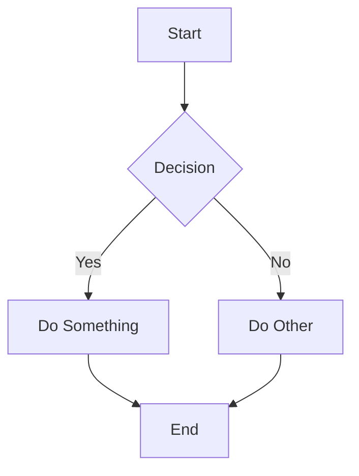
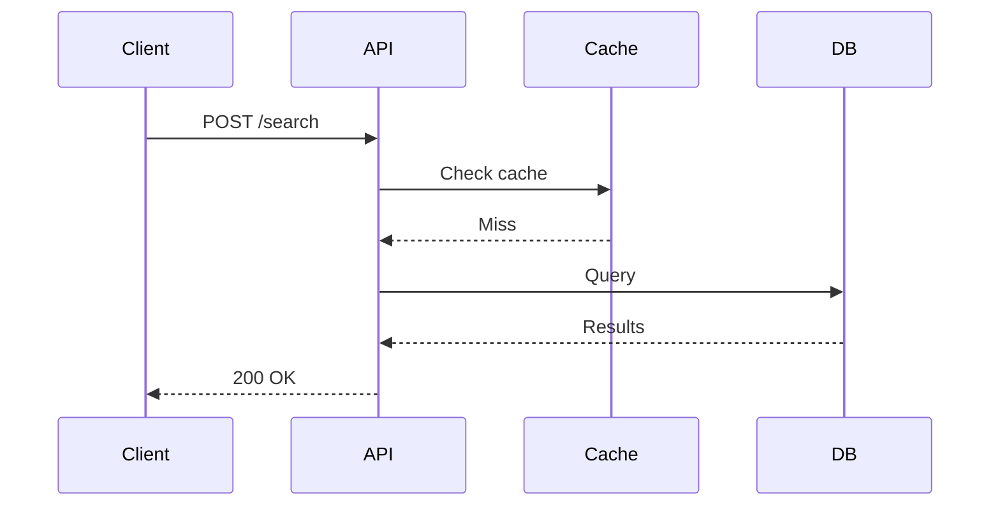
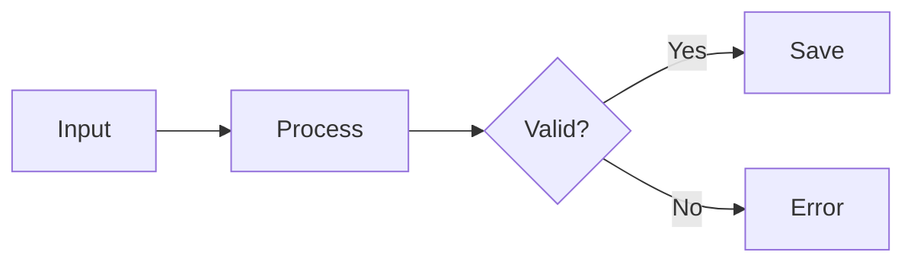

# Widget Spec Reference

## Fenced block syntax

Embed widgets in markdown using `widget` fenced code blocks:

````markdown
```widget
{
  "widgetId": "unique-id",
  "type": "chart",
  "config": { ... }
}
```
````

## Chart widget

The `chart` type renders Chart.js charts. The `config` object is a standard Chart.js configuration.

### Bar chart

```json
{
  "widgetId": "revenue-bar",
  "type": "chart",
  "config": {
    "type": "bar",
    "data": {
      "labels": ["Jan", "Feb", "Mar", "Apr", "May", "Jun"],
      "datasets": [
        { "label": "Revenue ($k)", "data": [40, 57, 50, 72, 68, 88] },
        { "label": "Expenses ($k)", "data": [29, 35, 39, 44, 37, 51] }
      ]
    }
  }
}
```

### Line chart

```json
{
  "widgetId": "growth-line",
  "type": "chart",
  "config": {
    "type": "line",
    "data": {
      "labels": ["W1", "W2", "W3", "W4"],
      "datasets": [
        { "label": "Users", "data": [100, 250, 480, 720], "fill": false }
      ]
    }
  }
}
```

### Doughnut / Pie chart

```json
{
  "widgetId": "segment-pie",
  "type": "chart",
  "config": {
    "type": "doughnut",
    "data": {
      "labels": ["Enterprise", "SMB", "Consumer"],
      "datasets": [{ "data": [45, 35, 20] }]
    }
  }
}
```

Use `"type": "pie"` for a filled pie chart.

### Horizontal bar chart

```json
{
  "widgetId": "comparison",
  "type": "chart",
  "config": {
    "type": "bar",
    "data": {
      "labels": ["Feature A", "Feature B", "Feature C"],
      "datasets": [{ "label": "Score", "data": [85, 72, 93] }]
    },
    "options": { "indexAxis": "y" }
  }
}
```

## Diff widget

Use `diff` fenced code blocks with a JSON spec containing `old` and `new` code strings. Only changed lines are shown (no unchanged context). Shows a summary line ("Added N lines, removed M lines").

````markdown
```diff
{
  "language": "typescript",
  "filename": "src/index.ts",
  "old": "import { uniqueSlug } from \"./slug\"\nimport * as db from \"./db\"",
  "new": "import { uniqueSlug, anonName } from \"./slug\"\nimport * as db from \"./db\""
}
```
````

### Spec fields

| Field | Required | Description |
|-------|----------|-------------|
| `old` | Yes | The original code string |
| `new` | Yes | The updated code string |
| `language` | No | Language for syntax highlighting (e.g., `javascript`, `typescript`, `python`, `rust`) |
| `filename` | No | Filename shown as a bold header above the diff |

- Uses `jsdiff` for line-level diffing and `highlight.js` for syntax coloring
- Only added (+) and removed (-) lines are displayed — unchanged lines are hidden
- Bold red/green row backgrounds, no borders or grid lines
- `\n` in strings represents newlines within the code

## Mermaid diagrams

Use standard `mermaid` fenced code blocks — no JSON wrapper needed:

````markdown

````

All Mermaid diagram types are supported: `graph`/`flowchart`, `sequenceDiagram`, `classDiagram`, `stateDiagram`, `erDiagram`, `gantt`, `pie`, `gitgraph`, `mindmap`, `timeline`, etc.

Theme adapts automatically to dark/light mode. Mermaid is loaded from CDN on first use.

### Sequence diagram

````markdown

````

### Flowchart

````markdown

````

## Citations

Use `[^key]` markers inline and `[^key]: text` definitions at the bottom. Hover shows a rich markdown tooltip. A "References" section is auto-generated.

```markdown
The scoring function[^1] outperforms alternatives[^2].

[^1]: Simple reference — Cormack et al., 2009. "RRF." SIGIR.
[^2]: Rich reference with code:
  ```python
  def rrf(ranks, k=60):
      return sum(1/(k + r) for r in ranks)
  ```
  See Cormack et al., 2009.
```

- Continuation lines must be indented by **2 spaces** (including fenced code blocks)
- Tooltip renders full markdown: `code`, **bold**, code blocks
- Numbers assigned in order of first appearance

## Math / LaTeX widget

Use `math` fenced code blocks for KaTeX rendering:

````markdown
```math
x = \frac{-b \pm \sqrt{b^2 - 4ac}}{2a}
```
````

Display mode by default. Loaded from CDN on first use.

## Table widget

Use `table` fenced code blocks with JSON. Headers are clickable to sort.

```json
{
  "caption": "Team Stats",
  "columns": ["Name", "Role", "Score"],
  "rows": [
    {"Name": "Alice", "Role": "Engineer", "Score": 95},
    {"Name": "Bob", "Role": "Designer", "Score": 88}
  ],
  "sortable": true
}
```

- `columns` is optional — inferred from first row's keys
- `rows` can be objects or arrays
- `sortable` defaults to `true`

## Map widget

Use `map` fenced code blocks. Renders MapLibre GL with CARTO vector tiles (Dark Matter / Voyager).

```json
{
  "center": [20, 110],
  "zoom": 4,
  "markers": [
    {"location": [1.35, 103.82], "label": "Singapore", "color": "#6a8ac0"},
    {"location": [39.90, 116.41], "label": "Beijing", "color": "#C15F3C"}
  ],
  "height": "400px",
  "controls": false
}
```

- `center` and `location` use `[lat, lng]` format
- If no `center`, auto-fits to marker bounds
- `controls: true` shows zoom/compass buttons (hidden by default)
- `pitch` and `bearing` for 3D tilt/rotation
- `style` for custom MapLibre style URL

## Timeline widget

Use `timeline` fenced code blocks. Vertical timeline with colored dots.

```json
{
  "events": [
    {"date": "2025-01-15", "title": "Kickoff", "description": "Project started", "color": "#6a8ac0"},
    {"date": "2025-03-01", "title": "Launch", "description": "v1.0 released", "color": "#7aa874"}
  ],
  "direction": "asc"
}
```

- `direction`: `"asc"` (default) or `"desc"`
- Colors auto-cycle if not specified

## Calendar widget

Use `calendar` fenced code blocks. Month grid with colored event bars.

```json
{
  "month": "2025-03",
  "events": [
    {"start": "2025-03-01", "end": "2025-03-03", "title": "Sprint 1", "color": "#6a8ac0"},
    {"start": "2025-03-08", "end": "2025-03-10", "title": "Sprint 2", "color": "#7aa874"}
  ]
}
```

- `month` is optional — inferred from earliest event
- Today's date gets a subtle outline

## Embed widget

Use `embed` fenced code blocks with a URL. Sanitized iframe with domain allowlist.

````markdown
```embed
https://www.youtube.com/watch?v=dQw4w9WgXcQ
```
````

Allowed: YouTube, Vimeo, Loom, Figma, CodeSandbox, StackBlitz, CodePen, Google Docs, Airtable, Notion, Miro, Whimsical. Share URLs auto-convert to embed URLs.

Spec object form: `{"url": "...", "width": "100%", "height": "400px", "aspectRatio": "16/9"}`

## Sketch widget

Use `sketch` fenced code blocks. Hand-drawn diagrams via Rough.js.

```json
{
  "width": 500,
  "height": 200,
  "elements": [
    {"type": "rect", "x": 30, "y": 60, "width": 130, "height": 70, "fill": "#a5d8ff", "color": "#1971c2", "label": "Client"},
    {"type": "arrow", "x1": 160, "y1": 95, "x2": 280, "y2": 95, "color": "#868e96", "label": "REST"},
    {"type": "ellipse", "x": 280, "y": 60, "width": 130, "height": 70, "fill": "#b2f2bb", "color": "#2f9e44", "label": "Done"}
  ]
}
```

Element types:
- `rect`: `x, y, width, height, color?, fill?, label?, fontSize?`
- `ellipse`: `x, y, width, height, color?, fill?, label?, fontSize?`
- `line`: `x1, y1, x2, y2, color?`
- `arrow`: `x1, y1, x2, y2, color?, label?, fontSize?`
- `text`: `x, y, text, color?, fontSize?`

## Globe widget

Use `globe` fenced code blocks. Interactive WebGL globe via COBE.

```json
{
  "markers": [
    {"location": [37.77, -122.42], "size": 0.1},
    {"location": [51.51, -0.13], "size": 0.08}
  ],
  "phi": 0,
  "theta": 0.2,
  "rotateSpeed": 0.005
}
```

## Rules

- `widgetId` must be unique within the document (for chart widgets)
- Chart `type` must be `"chart"` — use `config` for Chart.js configuration
- Mermaid diagrams use standard `mermaid` code blocks — no widgetId or JSON needed
- Colors are auto-assigned from the engei palette — don't specify colors unless you need specific ones
- Keep data inline for small datasets; the spec is declarative JSON only (no JS)
- Radial charts (pie, doughnut) automatically hide axis scales
- Legend auto-shows for multi-dataset charts
