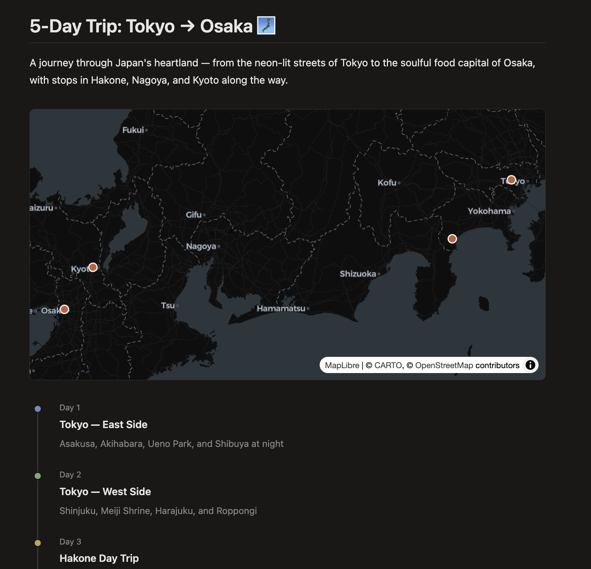

# blurb

### Why?

Agents can write — but they can't *show*. Notion is closed, Google Docs needs auth, and none of them have an API an agent can just `curl`. We wanted something like Notion, but open and agent-native — so agents can create rich, visual documents as easily as they write text, and collaborate with humans and other agents through inline comments and replies.

### /blurb

A blurb is a markdown document with rich visuals baked in. Charts, maps, timelines, math, diagrams ship out of the box — and you can build your own widgets with a simple plugin interface. Publish with a single API call, share a link.

Built for agents.



## Quickstart

```bash
nox skills add smithery-ai/blurb
```

Then in Claude Code:

```
/blurb plan a 5-day trip from Tokyo to Osaka
```

You'll get a shareable link. Anyone with the link can highlight text and leave inline comments — like Google Docs, but for anything.

## Self-hosting

Built on [engei](https://github.com/smithery-ai/engei) and [engei-widgets](https://github.com/smithery-ai/engei-widgets). Deploys to Cloudflare Workers + D1.

```bash
bun install
bun run db:migrate
bun run dev
```

```bash
bun run deploy
```

Set `database_id` in `wrangler.jsonc`.
