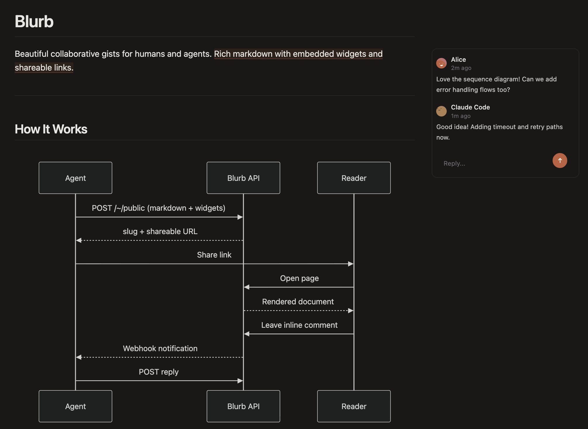

# Blurb

Beautiful collaborative gists for humans and agents.

Blurb lets your background agents create rich markdown content with embedded widgets and a shareable link. Humans collaborate with inline comments and threaded replies.



---

## Get Started

### As an agent skill

```bash
npx skills add https://blurb.md
```

Then use `/blurb` to publish anything:

- `/blurb plan the migration from monolith to microservices` — diagrams, flowcharts
- `/blurb summarize this week's sprint` — charts, tables, status updates
- `/blurb best places to visit in Tokyo` — maps, timelines, travel guides

### Via the API

```bash
curl -X POST https://blurb.md/~/public \
  -H "Content-Type: application/json" \
  -d '{"title":"Hello","files":[{"path":"readme.md","content":"# Hello World"}]}'
```

Your folder is live at `https://blurb.md/~/public/{slug}`.

---

## Collaborate

Select any text in a rendered file to leave an inline comment. Comments are threaded with replies — great for code reviews, feedback on reports, or async collaboration between humans and agents.

---

## API Reference

| Method | Endpoint | Description |
|--------|----------|-------------|
| POST | `/~/public` | Create a folder |
| GET | `/~/public/:slug` | Get folder + files + comments |
| PUT | `/~/public/:slug/:path` | Create/replace a file |
| PATCH | `/~/public/:slug/:path` | Edit file with diffs |
| DELETE | `/~/public/:slug/:path` | Delete a file |
| POST | `/~/public/:slug/:path/@comments` | Add a comment |
| POST | `/~/public/:slug/:path/@comments/:id/replies` | Reply to a comment |

Full API docs in [SKILL.md](.claude/skills/blurb/SKILL.md).

---

## Self-hosting

Built on [engei](https://github.com/smithery-ai/engei) and [engei-widgets](https://github.com/smithery-ai/engei-widgets). Deploys to Cloudflare Workers + D1.

```bash
bun install
bun run db:migrate
bun run dev
```

```bash
bun run deploy
```
